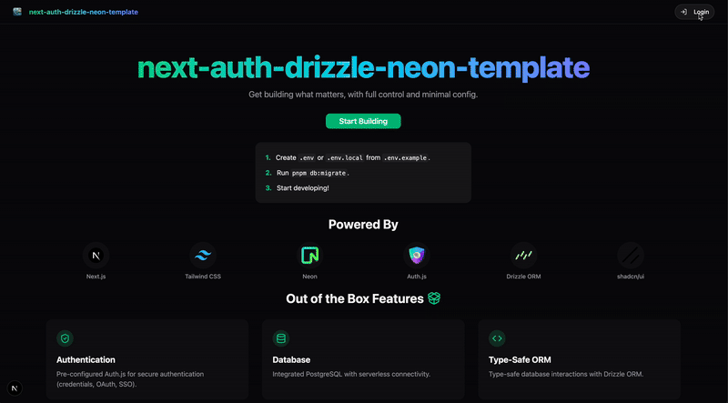

# Next.js Auth Drizzle Neon Template





A starter template for Next.js using the App Router, pre-configured with Auth.js (v5), Drizzle ORM, Neon (Serverless Postgres), Tailwind CSS, and shadcn/ui.

## ✨ Core Stack

*   **Framework:** [Next.js](https://nextjs.org/) (App Router)
*   **Authentication:** [Auth.js (NextAuth.js v5)](https://authjs.dev/) (Credentials and SSO provider included)
*   **Database:** [Neon](https://neon.tech/) (Serverless PostgreSQL)
*   **ORM:** [Drizzle ORM](https://orm.drizzle.team/)
*   **Styling:** [Tailwind CSS](https://tailwindcss.com/)
*   **UI Components:** [shadcn/ui](https://ui.shadcn.com/)
*   **Theming:** Light/Dark mode via `next-themes`
*   **Linting/Formatting:** Biome (configured)

## 🚀 Getting Started

1.  **Create your app using this template:**
    ```bash
    npx create-next-app@latest your-project-name --use-pnpm --example "https://github.com/yoav0gal/next-auth-drizzle-neon-template"
    ```

    ```bash
     cd your-project-name
    ```

2.  **Install Dependencies (if needed):**
    `create-next-app` should handle this, but if not, use `pnpm install`.

3.  **Set Up Environment Variables:**
    *   Copy `.env.example` to `.env.local`: `cp .env.example .env.local`
    *   Fill in `AUTH_SECRET` (generate with `pnpx auth secret`) and `DATABASE_URL` (from your Neon project) in `.env.local`.

4.  **Run Database Migrations:**
    ```bash
    pnpm db:migrate
    ```

5.  **Run the Development Server:**
    ```bash
    pnpm dev
    ```
    Open [http://localhost:3000](http://localhost:3000).

## 🛠️ Available Scripts

```json
{
  "dev": "next dev --turbo",
  "build": "tsx lib/db/migrate && next build",
  "start": "next start",
  "lint": "next lint && biome lint --write --unsafe",
  "lint:fix": "next lint --fix && biome lint --write --unsafe",
  "format": "biome format --write",
  "db:generate": "drizzle-kit generate",
  "db:migrate": "npx tsx src/lib/db/migrate.ts",
  "db:studio": "drizzle-kit studio",
  "db:push": "drizzle-kit push",
  "db:pull": "drizzle-kit pull",
  "db:check": "drizzle-kit check",
  "db:up": "drizzle-kit up"
}
```
